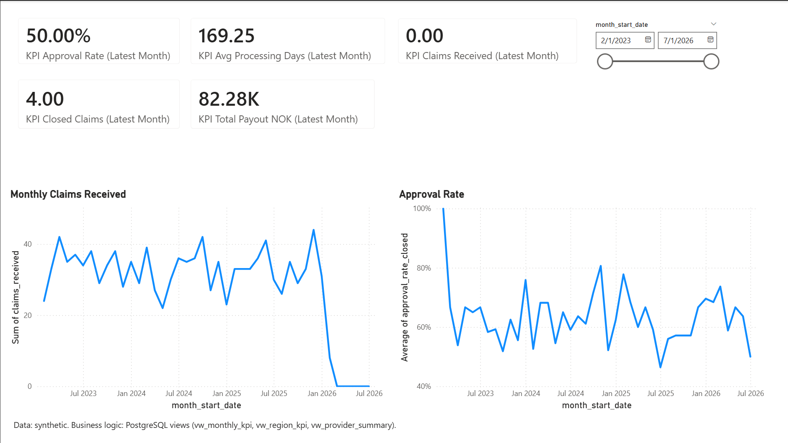
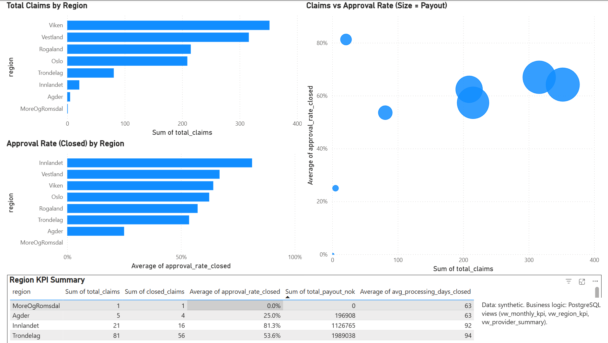
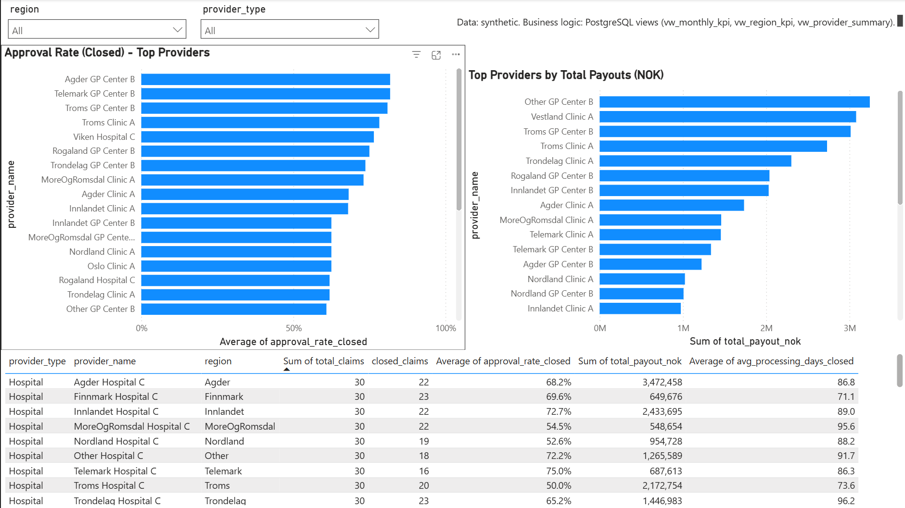

# SQL NPE Claims Analytics (Synthetic)

## Overview
I built a SQL-first claims analytics project using a synthetic dataset inspired by an insurance claims workflow.
PostgreSQL is the source of truth: I generate the dataset, run analytics queries, and expose a reporting layer as SQL views.
Power BI consumes only those views (no base tables) to produce an executive-ready dashboard.

## Tech stack
- PostgreSQL 16
- SQL (schema, seed, analytics queries, reporting views)
- Power BI Desktop (Windows) — report consumes SQL views only
- Git / GitHub

## Data model (schema summary)
Tables (6 total):
- `providers` — provider dimension (name, type, region, active)
- `claims` — claims lifecycle fact table (dates, status/decision, payout, processing fields)
- `medical_codes` — medical code dimension (system, code, title, active)
- `claim_medical_codes` — bridge table (many-to-many: claims ↔ medical codes)
- `injury_types` — injury type dimension
- `claim_injuries` — bridge table (claims ↔ injury types)

## How to run locally
Prereqs:
- PostgreSQL 16 installed and running
- A local database named `npe_claims_demo`

Create the database (if needed):

```
createdb npe_claims_demo
```

Run the SQL scripts in order:

```
psql -d npe_claims_demo -f sql/01_schema.sql
psql -d npe_claims_demo -f sql/02_seed_data.sql
psql -d npe_claims_demo -f sql/05_views.sql
psql -d npe_claims_demo -f sql/03_queries_basic.sql
psql -d npe_claims_demo -f sql/04_queries_intermediate.sql
```

## Reporting layer & business questions
PostgreSQL holds all the logic. Basic and intermediate queries feed three reporting views that Power BI consumes directly (no base tables):

- `vw_monthly_kpi` — month grain: claims received/closed, approval & rejection rates, payout, processing days
- `vw_region_kpi` — region-grain KPIs
- `vw_provider_summary` — provider grain: volume, approval rate, total payout

These answer typical stakeholder questions, each traceable to a view:

- **Volume over time** — how claim intake evolves by month
- **Approval / rejection by region** — computed on Closed claims only, NULL-safe so empty months don't mislead
- **Provider workload & payout** — Top-N providers by volume and total payout
- **Processing time** — days from received to decision (Closed claims), broken down by care level
- **Data quality** — constraint checks that must return 0 (e.g. a Closed claim with no decision, or a decision dated before receipt)

> The dataset is synthetic, so any numbers are illustrative — the point is the traceable SQL reporting layer, not real-world findings.

## Engineering highlights
- **Star-style schema** — a `claims` fact table with `providers`, `medical_codes` and `injury_types` dimensions, plus bridge tables for the two many-to-many relationships
- **Integrity enforced in the database** — value whitelists, "Closed requires a decision", `decision_date ≥ received_date`, non-negative amounts
- **Rerun-friendly synthetic seed** — pure SQL (`TRUNCATE … RESTART IDENTITY`); ~1,200 claims, 39 providers, 84 medical codes
- **Caught and fixed a real bug** — an early uniformity artifact (random sampling acting like a single "pick once") corrected with correlated, deterministic per-claim sampling
- **Thin Power BI** — imports only the three views, minimal DAX, standardized aggregations (Sum for counts/payout, Average for rates/durations)

## Dashboard
A three-page Power BI report built directly on the SQL views — Power BI does no business logic, it only presents what the views return.

**Executive Overview** — latest-month KPI cards, monthly claims-received trend, and approval-rate trend.



**Region Performance** — claims and approval rate by region, a volume-vs-rate scatter (bubble size = payout), and a region KPI table.



**Provider Summary** — top providers by approval rate and by total payout, with a sortable provider KPI table and region/type slicers.



Full write-up: [docs/SQL_NPE_Claims_Analytics_Report_Babak_Balouch.pdf](docs/SQL_NPE_Claims_Analytics_Report_Babak_Balouch.pdf)Report_Babak_Balouch.pdf)
